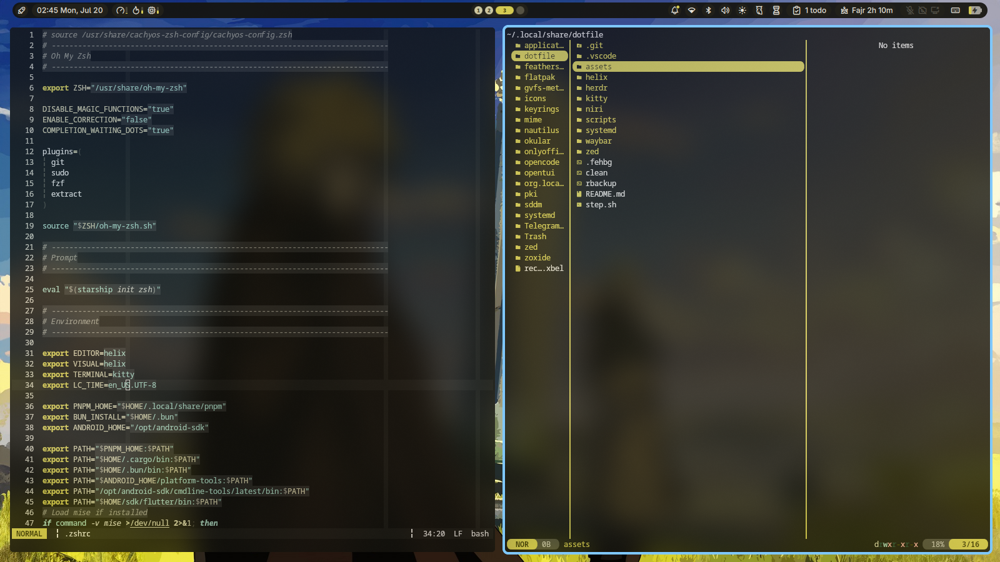

# Dotfiles



Personal dotfiles for Arch Linux with niri (Wayland compositor).

Configs are symlinked directly from `~/.config/` into this repo. Edit in `~/.config/`, changes are tracked here.

## Managed Configs

| Tool    | Repo Path                         | Symlink Target                       |
|---------|-----------------------------------|--------------------------------------|
| niri    | `niri/`                           | `~/.config/niri`                     |
| kitty   | `kitty/kitty.conf`                | `~/.config/kitty/kitty.conf`         |
| kitty   | `kitty/current-theme.conf`        | `~/.config/kitty/current-theme.conf` |
| kitty   | `kitty/noctalia.conf`             | `~/.config/kitty/themes/noctalia.conf`|
| helix   | `helix/config.toml`               | `~/.config/helix/config.toml`        |
| helix   | `helix/languages.toml`            | `~/.config/helix/languages.toml`     |
| helix   | `helix/noctalia.toml`             | `~/.config/helix/themes/noctalia.toml`|
| herdr   | `herdr/config.toml`               | `~/.config/herdr/config.toml`        |
| zed     | `zed/settings.json`               | `~/.config/zed/settings.json`        |
| zed     | `zed/noctalia.json`               | `~/.config/zed/themes/noctalia.json` |

## Setup on a New Machine

```bash
git clone https://github.com/Abdogouhmad/dotfile ~/.local/share/dotfile

# niri
rm -rf ~/.config/niri
ln -s ~/.local/share/dotfile/niri ~/.config/niri

# kitty
rm ~/.config/kitty/kitty.conf
ln -s ~/.local/share/dotfile/kitty/kitty.conf ~/.config/kitty/kitty.conf
rm ~/.config/kitty/current-theme.conf
ln -s ~/.local/share/dotfile/kitty/current-theme.conf ~/.config/kitty/current-theme.conf
rm ~/.config/kitty/themes/noctalia.conf
ln -s ~/.local/share/dotfile/kitty/noctalia.conf ~/.config/kitty/themes/noctalia.conf

# helix
rm ~/.config/helix/config.toml
ln -s ~/.local/share/dotfile/helix/config.toml ~/.config/helix/config.toml
rm ~/.config/helix/languages.toml
ln -s ~/.local/share/dotfile/helix/languages.toml ~/.config/helix/languages.toml
rm ~/.config/helix/themes/noctalia.toml
ln -s ~/.local/share/dotfile/helix/noctalia.toml ~/.config/helix/themes/noctalia.toml

# herdr
rm ~/.config/herdr/config.toml
ln -s ~/.local/share/dotfile/herdr/config.toml ~/.config/herdr/config.toml

# zed
rm ~/.config/zed/settings.json
ln -s ~/.local/share/dotfile/zed/settings.json ~/.config/zed/settings.json
rm ~/.config/zed/themes/noctalia.json
ln -s ~/.local/share/dotfile/zed/noctalia.json ~/.config/zed/themes/noctalia.json
```

## Scripts

- `step.sh` - install packages and set up a fresh system
- `scripts/` - utility scripts (update, package lists, etc.)
